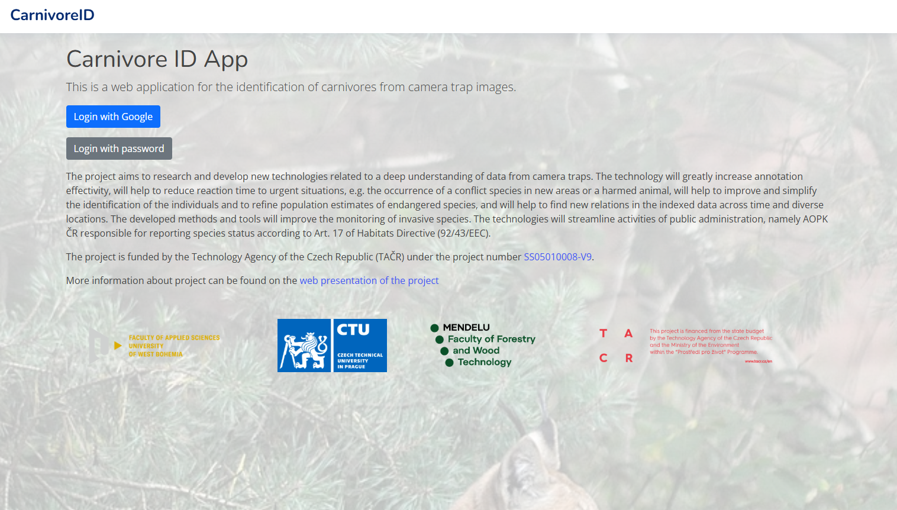
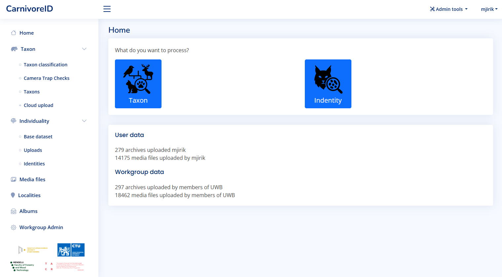

User can start using the application by logging in. The application is available at [https://caid.kky.zcu.cz/](https://caid.kky.zcy.cz/).

User account can be created by the administrators, or the existing Google login via OAuth technology can be used for authentication.

After logging in, the dashboard is displayed. There you can see the base statistic information about
uploaded media files.

The two main usage scenarios are:

* [Taxon classification](taxon_classification.md) - the user can classify images according to the species
* [Individuality re-identification](identification.md) - the user can identify individuals in the images

The taxon classification is available for all users. The individual identification is available for
cooperating groups and users. If you are interested in the individuality identification, [contact us](contact.md).

