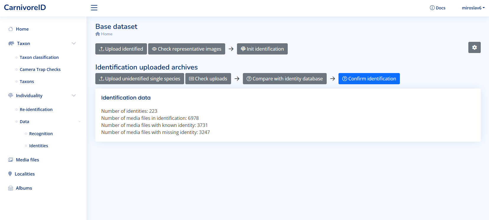
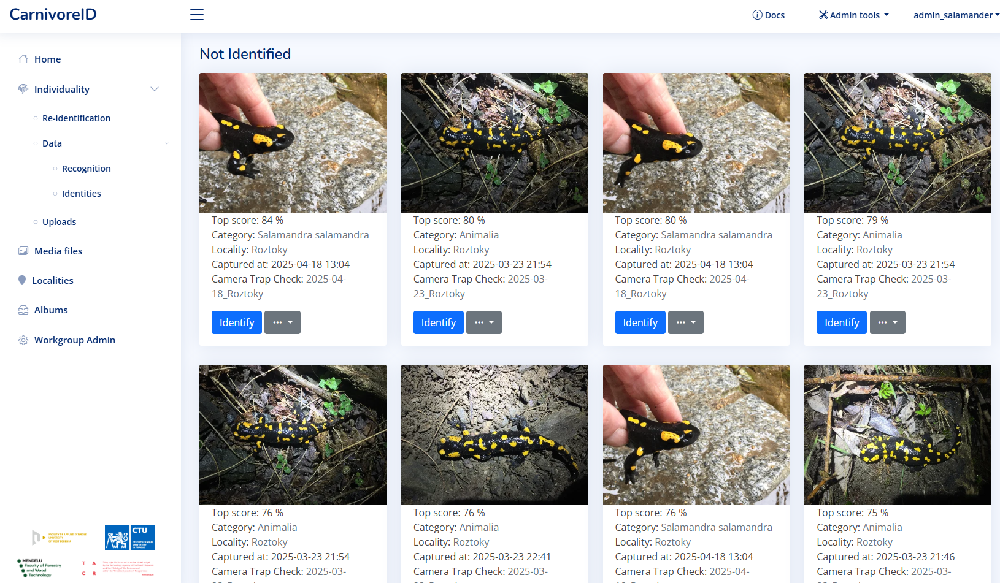

# Identification

After the user has done the [first steps](first_steps.md), the identification can be started. The identification is available for cooperating groups and users.

You should start on identification dashboard:

## Get the data for identification process

There are two ways how to get the data into the application:

  * Use the taxon classification [see taxon classification](taxon_classification.md) to 
    sort the media files by species. The output can be passed into the identification process. 
  * [Upload the media files directly](identification_upload.md) to the identification process].

## Confirm identification

The identification is done by confirming the identity of the individual in the image. 

