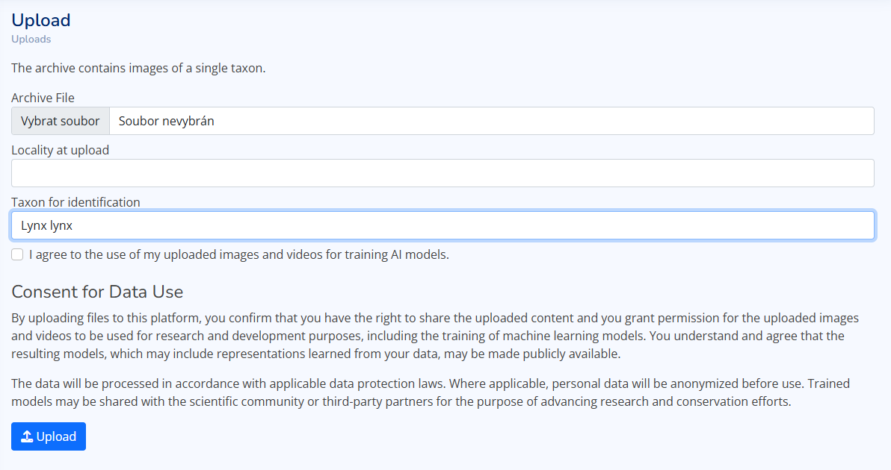
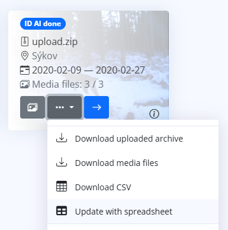

# Upload data for identification

There are several ways how to upload media files and metadata to the identification process.

## No oranized database, just images and videos

If you have no existing organized database, you can upload a ZIP archive with images and videos into
the application and the representatives of the individuals will be then selected manually in the web interface.
  


## Identities organized in directories

If you have existing organized database in directories with the name of the identity,
  you can upload a ZIP archive with this structure into the application.
  The uploaded archive must contain directories with the name of the identity. The images and videos of the 
  individuals must be inside these directories.
```aiignore
upload.zip
├── Bastien/
│   ├── image1.jpg
│   ├── image2.jpg
│   └── video1.mp4
├── Luna/
│   ├── image1.png
│   └── image2.jpg
└── Max/
   ├── video1.webp
   └── video2.mp4
```

## Metadata in spreadsheet

* If your metadata are more complex, you can prepare a CSV or XLSX file with the metadata and a ZIP archive with images and videos.
  The `original_path` is required in the uploaded spreadsheet. The `predicted_category`, `unique_name`, `locality name`, `latitude`, `longitude`, `datetime` are optional.
```aiignore
upload.zip
 ├── imgs/
 │   ├── im1.jpg
 │   └── im2.jpg
 ├── video1.mp4
 └── metadata.csv
```
  
   | `original_path` | `predicted_category` | `unique_name` | `locality name` | `latitude` | `longitude` | `datetime`          |
   |-----------------|----------------------|---------------|-----------------|------------|-------------|---------------------|
   | imgs/im1.jpg    | Lynx lynx            | Bastien       | Pod dubem       | 49.28021   | 13.1819     | 2023-10-01 14:30:00 |
   | imgs/im2.jpg    | Lynx lynx            | Luna          | Za kopcem       | 49.27921   | 13.8219     | 2023-10-01 15:00:00 |
   | video1.mp4      | Lynx lynx            | Bastien       | Pod dubem       | 49.28031   | 13.1819     | 2023-10-01 16:00:00 |

## Update metadata of media files in CarnivoreID database

If your data are already in the CarnivoreID database, you can update metadata of ZIP file using the spreadsheet file in 
  format mentioned above. The spreadsheet is uploaded from the menu shown blow.

  


