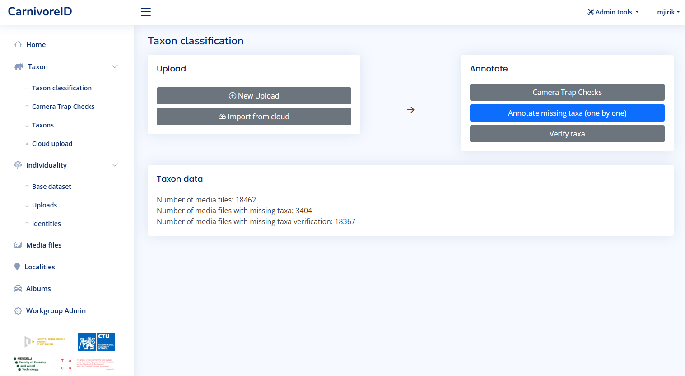
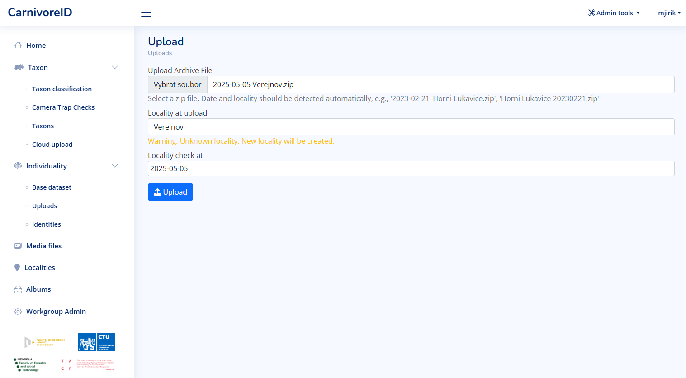
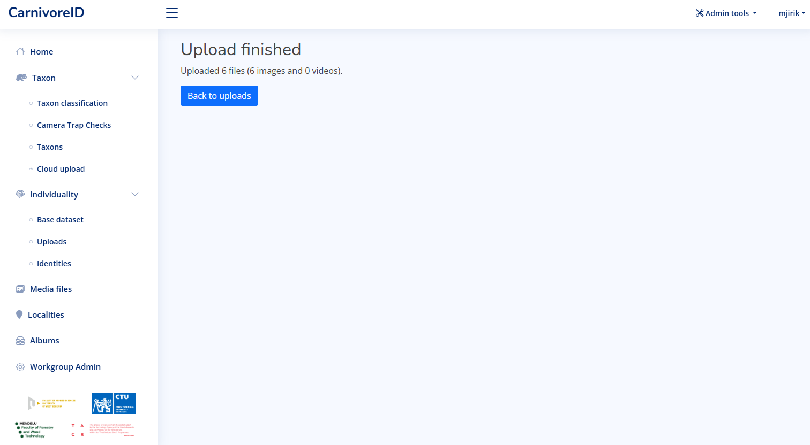
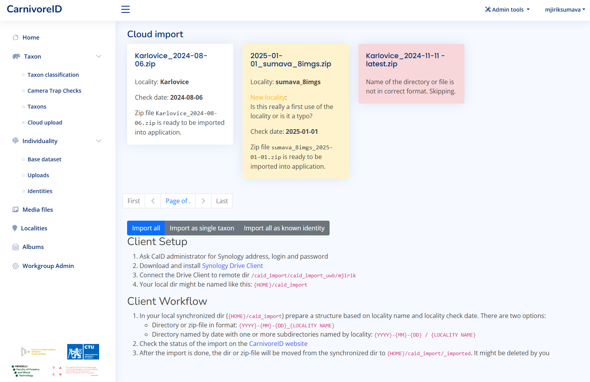
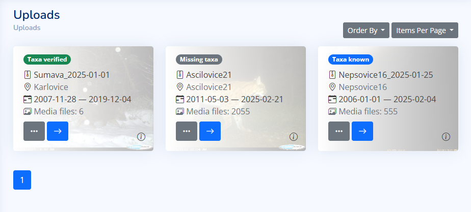
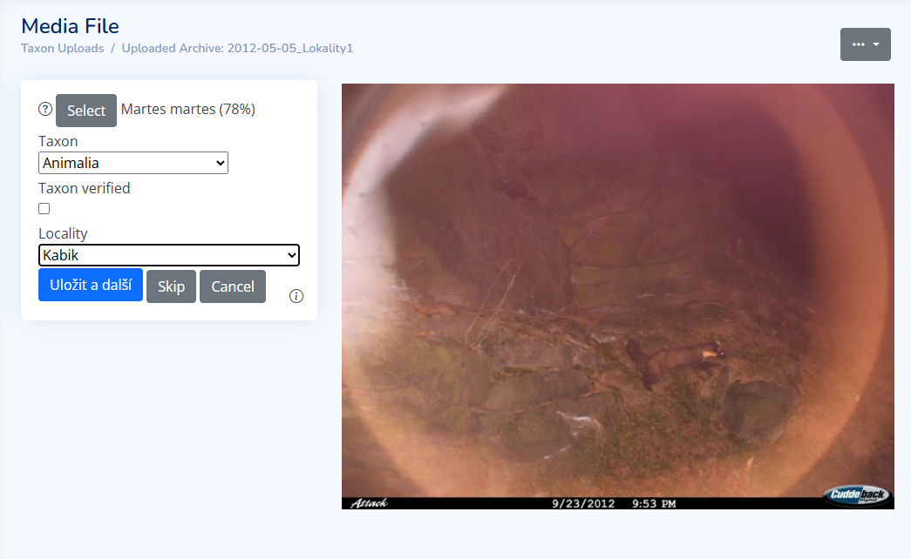

# Taxon classification

The taxon classification is available from the dashboard. The main view gives you the access to most important functions.

Users typically collect data by retrieving image data from a camera trap after a certain period of time. 
The first step is then to sort the images by animal species. 
As input for automatic species recognition, we expect a ZIP archive containing data from a single camera trap. 
The user only needs to confirm or provide the camera trap location. 
The classification of animal species in the images is carried out automatically. 
The output is a ZIP archive containing the input data organized into folders by species and a CSV file with metadata (such as date/time the image was taken, identified species, etc.).




## Data upload

The user can upload a ZIP archive containing images from a camera trap. The recommended naming 
contain the date of camera trap check and the name of the locality.



When the upload is finished, the taxon classification is started automatically.



## Upload using Synology Drive client

There is the possibility to upload multiple ZIP archives at once using the Synology Drive client. [Let us know](contact.md) if you are interested in this feature.

When the setup is done in cooperation with the administrator, there is a synchronized folder in the user computer.
All ZIP archives in this folder are automatically visible in the Cloud upload section of the application.
The file format require to combine the date of camera trap check and the name of the locality in the file name.



In the figure above, the user can see the files that are in the folder. The first one will be processed 
without any problems, the second one contains unknown locality (which will be automatically added to the database during upload),
and the third one will be skipped because the file name is not in correct format. 
User can change the file name in the shared directory and reload the page to see the changes.

There are three options to attach the locality and the date information to the zip file. 
* The file name contains the date and the locality name. The date is in the format YYYY-MM-DD.
* The synchronized directory contains a dir with the locality name. The files in this directory are named according to the date format YYYY-MM-DD.
* The synchronized directory contains a dir with the date in the format YYYY-MM-DD. The files in this directory are named according to the locality name.

```aiignore
shared_dir/
├── 2023-10-01/
│   ├── Locality1/
│   ├── Locality2/
│   └── Locality3/
├── 2023-10-02/
│   ├── locality1/
│   └── locality3/
└── Locality2/
    ├── 2023-07-01/
    └──  2022-10-01/
```

When the files are in the correct format, the user can click on the "Import all" button. The taxon classification will be started automatically.

The other buttons can be used for the identification workflow. In the case the all files contains the same taxon, the user can click on the "Import as single taxon".
If there exists a database of the identities, it can be imported using the "Import all as known identity" button.


## Camera trap checks

Each uploaded archive is considered as a camera trap check. The user can see the list of all camera trap checks in the application.





## Set missing taxa

The taxa classification is started automatically after the upload is finished. Usually, the classification is missing in
some media files. The user can set the missing taxa. It can be started from the Taxon classification view or from the Camera trap check view.



The media files with missing taxa are displayed. The user can select the taxa from the list or use the preselection based on the most probable taxa.


[//]: # (## Taxon verification)


