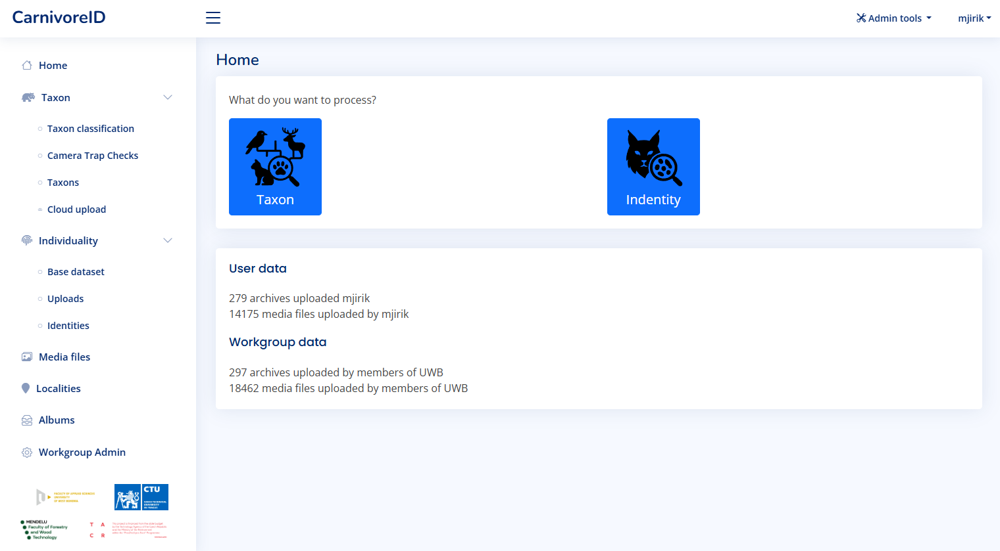

# User documentation 

The application is created to help categorize images according to the species and identify animals in camera trap images. 
The two main usage scenarios are:
* Taxon classification - the user can classify images according to the species
* Individuality re-identification - the user can identify individuals in the images

# First steps

User can start using the application by logging in. The application is available at [https://caid.kky.zcu.cz/](https://caid.kky.zcy.cz/).
User account can be created by the administrators, or the existing Google login via OAuth technology can be used for authentication.

After logging in, the dashboard is displayed. There you can see the base statistic information about
uploaded media files.

The taxon classification is available for all users. The individual identification is available for
cooperating groups and users. If you are interested in the individuality identification, [contact us](contact.md).

# Taxon classification

The taxon classification is available from the dashboard. The main view gives you the access to most important functions.

Users typically collect data by retrieving image data from a camera trap after a certain period of time. 
The first step is then to sort the images by animal species. 
As input for automatic species recognition, we expect a ZIP archive containing data from a single camera trap. 
The user only needs to confirm or provide the camera trap location. 
The classification of animal species in the images is carried out automatically. 
The output is a ZIP archive containing the input data organized into folders by species and a CSV file with metadata (such as date/time the image was taken, identified species, etc.).

## Data upload

The user can upload a ZIP archive containing images from a camera trap. The recommended naming 
contain the date of camera trap check and the name of the locality.

When the upload is finished, the taxon classification is started automatically.

## Upload using Synology Drive client

There is the possibility to upload multiple ZIP archives at once using the Synology Drive client. [Let us know](contact.md) if you are interested in this feature.

When the setup is done in cooperation with the administrator, there is a synchronized folder in the user computer.
All ZIP archives in this folder are automatically visible in the Cloud upload section of the application.
The file format require to combine the date of camera trap check and the name of the locality in the file name.

In the figure above, the user can see the files that are in the folder. The first one will be processed 
without any problems, the second one contains unknown locality (which will be automatically added to the database during upload),
and the third one will be skipped because the file name is not in correct format.

